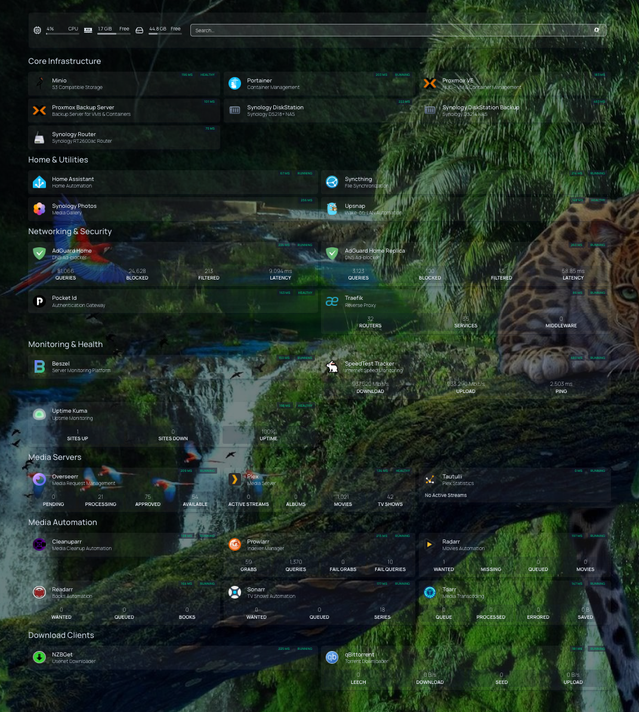

# AlborWorld's Homelab

A modular, GitOps-driven homelab infrastructure designed to provide security, privacy, and data ownership while automating and maintaining services across multiple devices.

> ⚠️ **Work in Progress**: This repository is under active development. Expect changes and improvements over time.

## 📚 Documentation

- [**Architecture**](docs/ARCHITECTURE.md) - Detailed overview of the homelab's architecture
- [**Setup Guide**](docs/SETUP.md) - Step-by-step instructions for setting up the homelab
- [**Security Practices**](docs/SECURITY.md) - Security guidelines and secrets management
- [**Deployment Guide**](docs/DEPLOYMENT.md) - Procedures for deploying and updating services

## 🏠 Overview

This repository contains the configuration and orchestration files for a personal homelab environment. The infrastructure is designed to be:
- 🔄 **Modular and maintainable**
- 🔄 **Reproducible** across different environments
- 🔄 **GitOps-driven** for automated deployments
- 🔄 **Energy-efficient** with scheduled power management

### 📊 Dashboard



## 🖥️ Hardware Infrastructure

### Core Components
- **Router**: Synology RT2600ac
- **NAS**: Synology DiskStation DS218+ (10 GB RAM, 2 x 5 TB HD)
- **Backup NAS**: Synology DiskStation DS214 (512 MB RAM, 2 x 1.8 TB HD) - Offsite backup
- **Compute Node**: Intel NUC 13 (64 GB RAM, 2 TB SSD) running Proxmox VE
- **Edge Node**: Raspberry Pi 5 (4 GB RAM, 64 GB SSD)

## 🧩 Architecture

### Docker Hosts
- **raspberrypi5**: Always-on edge node
  - Main DNS server
  - Critical services
- **diskstation**: Synology Docker host
  - Secondary DNS server
  - S3-compatible object storage
  - File synchronization
- **dockerhost**: Ubuntu VM on Proxmox VE
  - Media services stack
  - Resource-intensive applications

For detailed architecture and service information, see [docs/ARCHITECTURE.md](docs/ARCHITECTURE.md).

## 🛠️ Technology Stack

### Core Infrastructure
- **Containerization**: Docker & Docker Compose v2.21.0+
- **Secrets Management**: [SOPS](https://github.com/getsops/sops) with [age](https://github.com/FiloSottile/age) encryption
- **Reverse Proxy**: Traefik v3.4 with automatic SSL
- **DNS**: AdGuard Home / Unbound (HA setup)
- **Monitoring**: Uptime Kuma, Speedtest Tracker, UpSnap

### Media Stack
- **Media Management**: Plex, Sonarr, Radarr, Readarr
- **Download Clients**: NZBGet, qBittorrent
- **Media Processing**: Tdarr, Tautulli

## 📁 Repository Structure

```
homelab/
├── ansible/          # Infrastructure as Code
├── docker/           # Docker configurations (see docker/README.md)
├── k8s/              # Kubernetes configurations (future)
├── docs/             # Documentation
└── Makefile          # Common tasks
```

## 🔐 Security

- All secrets are encrypted using [SOPS](https://github.com/mozilla/sops) with [age](https://github.com/FiloSottile/age)
- Encrypted `.env.sops.enc` files are version controlled
- Plaintext secrets are never committed to the repository
- See [Security Practices](docs/SECURITY.md) for details on secrets management

## 🚀 Getting Started

1. Clone the repository:
   ```bash
   git clone git@github.com:alborworld/homelab.git ~/homelab
   ```

2. Follow the [Setup Guide](docs/SETUP.md) for host-specific instructions

3. For Docker deployments, see [docker/README.md](docker/README.md)

## 🚧 Roadmap

With the number of services now approaching 50, it's time to upgrade the homelab's orchestration to Kubernetes for improved scalability, reliability, and management.

Here are some of the planned improvements and features for the homelab:

- [ ] Set up K3s cluster on pve
- [ ] Set up GitOps with ArgoCD
- [ ] Use Terraform/OpenTofu to provision VMs in Proxmox and deploy Cloudflare distributions
- [ ] Use Ansible playbooks for automated setup and orchestration of VMs, Diskstation, and Raspberry Pi
- [ ] Deploy HashiCorp Vault / OpenBao for centralized and seamless secrets management
- [ ] Deploy Prometheus and Grafana for infrastructure monitoring
- [ ] Set up CI/CD pipelines for automated deployments

For the latest roadmap and planned features, see the [GitHub Projects board](https://github.com/users/alborworld/projects/3/views/4).

## 📄 License

This project is licensed under the MIT License - see the [LICENSE](LICENSE) file for details.