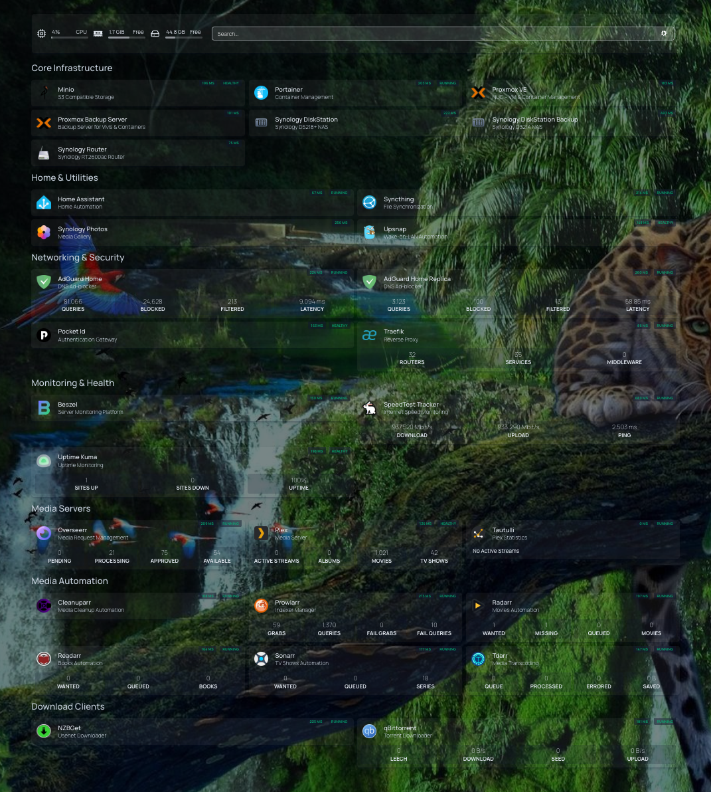

# AlborWorld's Homelab

A modular, GitOps-driven homelab infrastructure designed to provide security, privacy, and data ownership while automating and maintaining services across multiple devices.

> ⚠️ **Work in Progress**: This repository is under active development. Expect changes and improvements over time.

## 🏠 Overview

This repository contains the configuration and orchestration files for a personal homelab environment. The infrastructure is designed to be:
- Modular and maintainable
- Reproducible across different environments
- GitOps-driven for automated deployments
- Energy-efficient with scheduled power management

## 📊 Dashboard



*Overview of running services and applications across the homelab infrastructure*

## 🖥️ Hardware Infrastructure

### Core Components
- **Router**: Synology RT2600ac
- **NAS**: Synology DiskStation DS218+ (10 GB RAM, 2 x 5 TB HD)
- **Backup NAS**: Synology DiskStation DS214 (512 MB RAM, 2 x 1.8 TB HD)
- **Compute Node**: Intel NUC 13 (64 GB RAM, 2 TB SSD) running Proxmox VE
- **Edge Node**: Raspberry Pi 5 (4 GB RAM, 64 GB SSD)

## 🧩 Architecture

### Docker Hosts
- **raspberrypi5**: Always-on edge node
  - Main DNS server
  - Critical services
- **diskstation**: Synology Docker host
  - Secondary DNS server
  - S3-compatible object storage
  - File Synchronization
  - Zoom recordings download automation
  - etc.
- **dockerhost**: Ubuntu VM on Proxmox VE
  - Media services
  - etc.

### Infrastructure Features

For a detailed overview of infrastructure features—including DNS, power management, and security—see [docs/ARCHITECTURE.md](docs/ARCHITECTURE.md).

## 🛠️ Technology Stack

### Core Technologies
- **Containerization**: Docker & Docker Compose v2.21.0+
- **Secrets Management**: Mozilla SOPS for encrypted .env files
- **Reverse Proxy**: Traefik v3.4 with automatic SSL
- **DNS**: AdGuard Home / Unbound with high-availability setup
- **VPN**: WireGuard via Gluetun container
- **Monitoring**: 
  - Uptime Kuma for service monitoring
  - Speedtest Tracker for network performance
  - UpSnap for device power management

### Media Stack
- **Media Management**: 
  - Plex for media streaming
  - Sonarr, Radarr, Readarr for media automation
  - Prowlarr for indexer management
  - NZBGet & qBittorrent for downloads
  - Tautulli for Plex analytics
  - Tdarr for media transcoding

### Infrastructure
- **Container Management**: Portainer Agent
- **Service Discovery**: Traefik Kop for multi-host setup
- **Automation**: Watchtower for container updates
- **Monitoring**: Beszel for host health monitoring

## 📚 Documentation Overview

- [docs/ARCHITECTURE.md](docs/ARCHITECTURE.md):  
  _Detailed architecture of the homelab, including hardware, network topology, orchestration, and security practices._

- [raspberrypi5/README.md](raspberrypi5/README.md):  
  _Setup and management instructions for the Raspberry Pi 5 edge node._

- [dockerhost/README.md](dockerhost/README.md):  
  _Setup and management instructions for the Dockerhost (Proxmox VM) node._

- [diskstation/README.md](diskstation/README.md):  
  _Setup and management instructions for the Synology DS218+ node._

- [diskstation-backup/README.md](diskstation-backup/README.md):  
  _Instructions for configuring the Synology DS214 as a dedicated backup node, including Beszel Agent installation._

## 📁 Repository Structure

```
homelab/
├── diskstation/             # Synology DS218+ Docker stack and configs
│   ├── docker/              # Docker Compose files for DS218+
│   └── README.md
├── dockerhost/              # Proxmox VM Docker stack and configs
│   ├── docker/              # Docker Compose files for Dockerhost
│   └── README.md
├── raspberrypi5/            # Raspberry Pi 5 Docker stack and configs
│   ├── docker/              # Docker Compose files for Raspberry Pi 5
│   └── README.md
├── diskstation-backup/      # Synology DS214 general information and setup instructions
│   └── README.md
├── docs/                    # Documentation and images
│   ├── images/
│   └── ARCHITECTURE.md
├── LICENSE
├── Makefile
└── README.md                # Main project overview
```
- Each host directory contains:
  - `docker/`: Docker Compose files and service configs
  - `README.md`: Host-specific notes and instructions
  - `.env.sops.enc`: Encrypted environment variables (not shown above)
- `diskstation-backup/`: Special instructions for the backup-only DS214
- `docs/`: Architecture diagrams, images, and extended documentation

## 🔐 Security

- Environment variables and secrets are encrypted using [SOPS](https://github.com/mozilla/sops)
- Encrypted `.env.sops.enc` files are version controlled
- Plaintext secrets are never committed to the repository

### SOPS Usage

#### Encryption & Decryption with Makefile

To simplify encryption and decryption of `.env` files, use the provided `Makefile` targets. This ensures consistent usage of SOPS options and reduces manual steps.

**Examples:**

- Encrypt the `.env` file for a target (e.g., diskstation):
  ```bash
  make encrypt-diskstation
  ```
  This will encrypt `diskstation/docker/.env` to `diskstation/docker/.env.sops.enc`.

- Decrypt the `.env.sops.enc` file for a target (e.g., raspberrypi5):
  ```bash
  make decrypt-raspberrypi5
  ```
  This will decrypt `raspberrypi5/docker/.env.sops.enc` to `raspberrypi5/docker/.env`.

- Clean (remove) the decrypted `.env` file for a target:
  ```bash
  make clean-dockerhost
  ```

- Show the decrypted `.env` file for a target (print to stdout):
  ```bash
  make show-diskstation
  ```

#### Manual Encryption
To encrypt an existing `.env` file manually:
```bash
sops --input-type dotenv --output-type dotenv --encrypt .env > .env.sops.enc
```

#### Manual Decryption
To decrypt manually:
```bash
sops --input-type dotenv --output-type dotenv --decrypt .env.sops.enc > .env
```

> **Note**: When decrypting with SOPS, specifying `--input-type dotenv --output-type dotenv` ensures that the file is correctly interpreted and formatted as a dotenv file, preserving its structure and avoiding misinterpretation or formatting issues.

## 🚀 Common Usage

### Clone and Setup
1. Clone the repository:
   ```bash
   git clone git@github.com:alborworld/homelab.git ~/homelab
   ```

2. For each host, create a symlink to the appropriate directory:
   ```bash
   # For Raspberry Pi
   ln -s ~/homelab/raspberrypi5 ~/docker/compose
   
   # For Dockerhost
   ln -s ~/homelab/dockerhost ~/docker/compose
   
   # For Diskstation
   ln -s ~/homelab/diskstation /volume1/docker/compose
   ```

### Deployment
For each host, deploy using:
```bash
cd ~/docker/compose  # or /volume1/docker/compose for Diskstation
sops --input-type dotenv --output-type dotenv --decrypt .env.sops.enc > .env
docker compose up -d
```

## 🚧 Roadmap

With the number of services now approaching 50, it's time to upgrade the homelab's orchestration to Kubernetes for improved scalability, reliability, and management.

Here are some of the planned improvements and features for the homelab:

- [ ] Set up K3s cluster on pve
- [ ] Set up GitOps with ArgoCD
- [ ] Use Terraform/OpenTofu to provision VMs in Proxmox and deploy Cloudflare distributions
- [ ] Use Ansible playbooks for automated setup and orchestration of VMs, Diskstation, and Raspberry Pi
- [ ] Deploy HashiCorp Vault / OpenBao for centralized and seamless secrets management
- [ ] Deploy Prometheus and Grafana for infrastructure monitoring
- [ ] Set up CI/CD pipelines for automated deployments

For the latest roadmap and planned features, see the [GitHub Projects board](https://github.com/users/alborworld/projects/3/views/4).

## 📄 License

This project is licensed under the MIT License - see the [LICENSE](LICENSE) file for details.